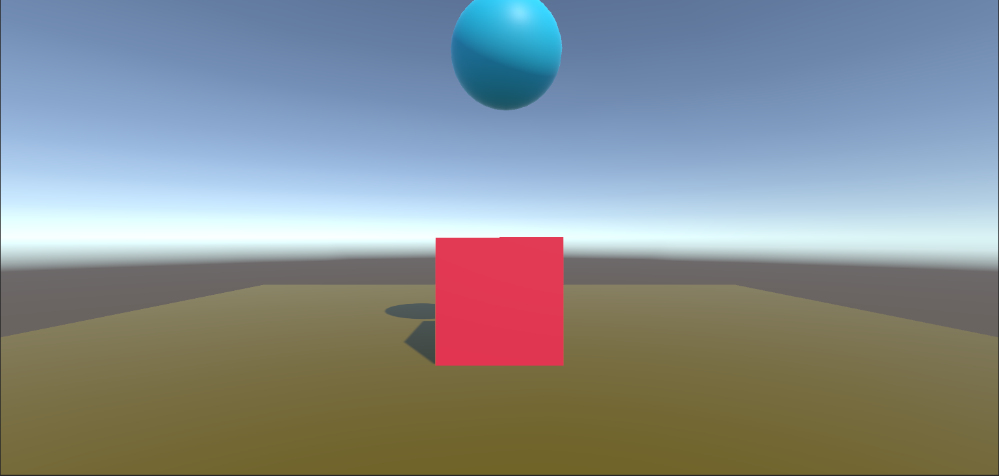
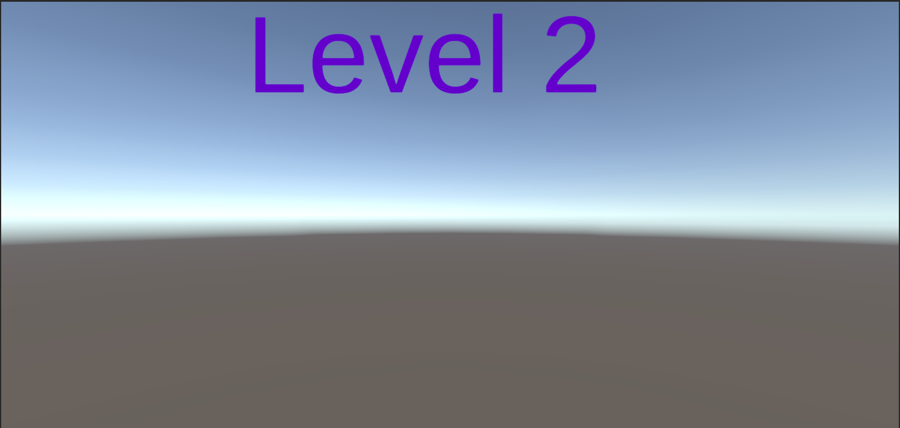

# REDIRECTING-THE-SCENE

## AIM:
To redirect a scene using C# program in Unity engine.

## ALGORITHM:
### Step 1: 
To open the unity engine.

### Step 2: 
Create a new plane and create a cube and give color for the cube.

### Step 3: 
Next create sphere in the orgin and change the z-axis and Give the color for the sphere.

### Step 4: 
Create a tag for the Sphere and Make the sphere and cube as a Rigidbodies and Make the sphere use Gravity.

### Step 5: 
Create the C# script file in the Assets and write the Coding for the Redirecting to the scene1 after hit the sphere to cube.

### Step 6: 
Next Create a another new scene named as scene1.

### Step 7:
In File->Build settings and drop the both first scene and scene1 scene in the Scenes in build setting.

### Step 8: 
Click the Build and run button in the Build settings and run the scene.

### Step 9: 
The Sphere after touching the cube it will disappeared and Press the key [R] the redircting to the new scene that is scene1.
## PROGRAM:
```
Developed by : Jeeva MS
Register number : 212221230040
```
### CUBE PROGRAM:
```C#
using System.Collections;
using System.Collections.Generic;
using UnityEngine.SceneManagement;
using UnityEngine;

public class CubeProgram : MonoBehaviour
{
    Rigidbody rb;
    public GameObject WinText;
    // Start is called before the first frame update
    void Start()
    {
        rb = GetComponent<Rigidbody>();
    }

    // Update is called once per frame
    void Update()
    {
        if(Input.GetKeyDown(KeyCode.R))
        {
            SceneManager.LoadScene("scene1");
        }
    }
    public void OnMouseDown()
    {
        Destroy(gameObject);
    }
    private void OnCollisionEnter(Collision collision)
    {
        if(collision.gameObject.tag=="Cube")
        {
            Destroy(collision.gameObject);
            WinText.SetActive(true);
        }
    }
}
```
## OUTPUT:
### SCENE BEFORE THE BALL HITS THE CUBE:

### SCENE AFTER THE BALL HITS THE CUBE:

### NEW SCENE AFTER REDIRECTING:

## RESULT:
Thus, a scene is redirected in Unity engine using a C# program.